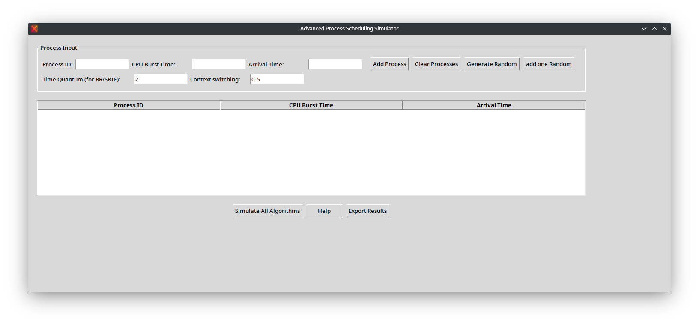
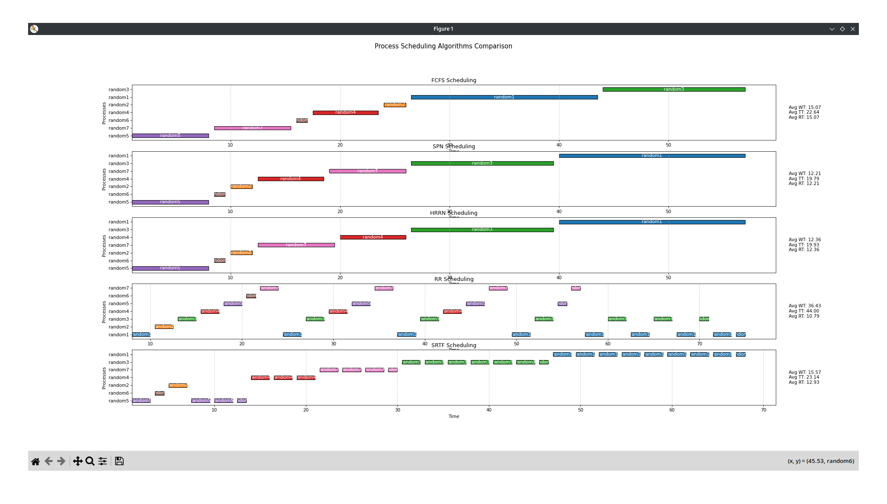
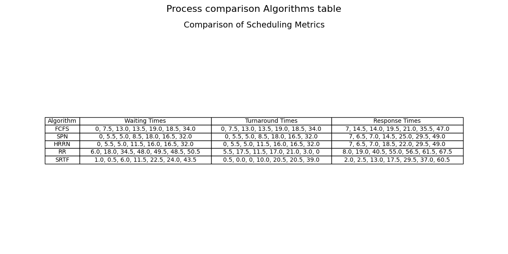

# Process Scheduling Simulator

## Overview

The Process Scheduling Simulator is an advanced educational tool designed to help students and professionals understand and compare different process scheduling algorithms in operating systems. This interactive GUI application allows users to simulate and visualize various scheduling strategies, providing insights into how different algorithms manage process execution.

## Features

### Scheduling Algorithms
The simulator supports five key scheduling algorithms:
- **FCFS (First-Come, First-Served)**: Processes are executed in the order they arrive
- **SPN (Shortest Process Next)**: Selects the process with the shortest CPU burst time
- **HRRN (Highest Response Ratio Next)**: Prioritizes processes based on waiting time and burst time
- **RR (Round Robin)**: Allocates CPU to processes in a cyclic manner with a time quantum
- **SRTF (Shortest Remaining Time First)**: Preemptive version of SPN, switches to shortest remaining job

### Key Functionalities
- Add, edit, and delete processes manually
- Generate random process sets
- Set custom time quantum and context switching time
- Visualize process execution with Gantt charts
- Compare performance metrics across algorithms
- Export simulation results to CSV

## Prerequisites

- Python 3.7+
- tkinter
- matplotlib
- numpy

## Installation

1. Clone the repository:
   ```bash
   git clone https://github.com/yourusername/process-scheduling-simulator.git
   ```

2. Install required dependencies:
   ```bash
   pip install tkinter matplotlib numpy
   ```

## Usage

1. Run the simulator:
   ```bash
   python process_scheduling_simulator.py
   ```

2. Add Processes:
   - Enter Process ID, CPU Burst Time, and Arrival Time
   - Click "Add Process" or use "Generate Random" to populate processes

3. Set Simulation Parameters:
   - Adjust Time Quantum for Round Robin and SRTF
   - Set Context Switching Time

4. Simulate:
   - Click "Simulate All Algorithms"
   - View Gantt charts and performance metrics
   - Compare waiting times, turnaround times, and response times

## Screenshots





## Performance Metrics

The simulator calculates and displays:
- Average Waiting Time
- Average Turnaround Time
- Average Response Time
- Detailed process execution timeline

## Help and Documentation

Use the built-in "Help" button in the application for a detailed guide on using the simulator and understanding scheduling algorithms.

## Supported Platforms

- Windows
- macOS
- Linux (with Tkinter and required dependencies)
